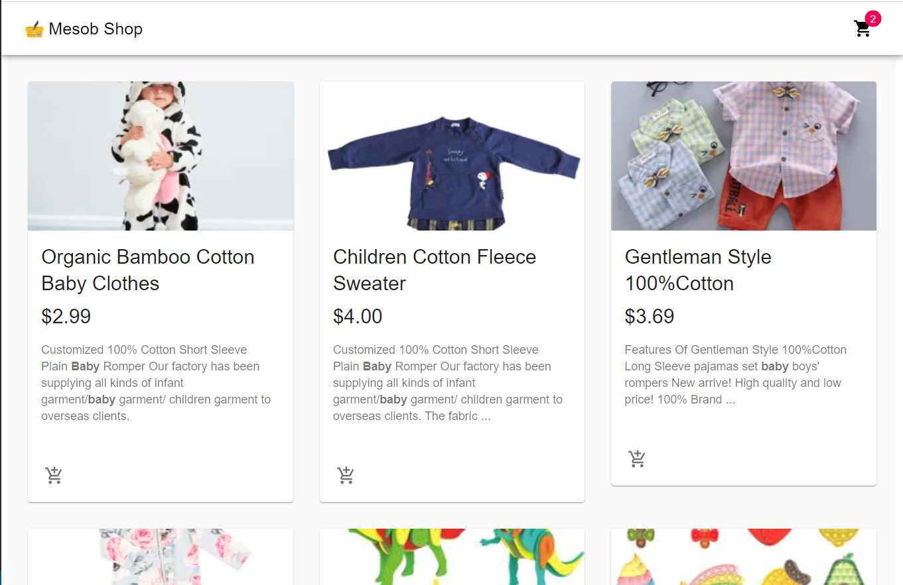
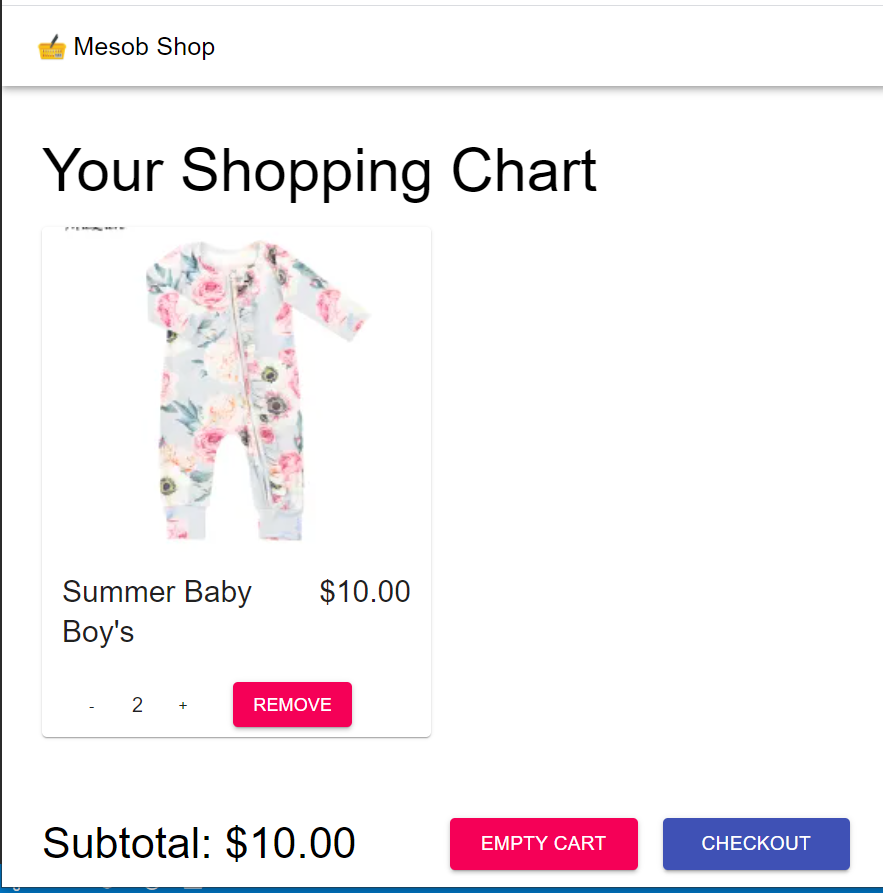

# E-Commerce 

In this project I buit an E-Commerce app using react, commerce-js and material-ui. 

## Built With

- Node.js
- React
- React-Create-App
- React-router-dom
- React-hook-form
- Material UI icons
- Material UI icons
- Stripe/react-stripe
- Stripe/stripe js
- npm
- ES6
- CSS

[Live Demo Link Netlify](https://mesob-shop.netlify.app/)

## Getting Started

To get a local copy and running follow these simple example steps.

### Setup

- Node js
- Clone the repo and cd in it.

### Install

- Run `npm install` in your terminal

### Usage

- Run `npm start` in your terminal

Runs the app in the development mode. 
Open [http://localhost:3000](http://localhost:3000) to view it in the browser.

### Tests

To run tests
- No tests yet

## Author

👤 **Samuel Teweldebrhan Ghebremeskel**

- Github: [@githubhandle](https://github.com/Samitti)
- Twitter: [@twitterhandle](https://twitter.com/Samuel63734232)
- Linkedin: [linkedin](https://www.linkedin.com/in/samuel-ghebremeskel-29685811a/)

## 🤝 Contributing

Contributions, issues and feature requests are welcome!

Feel free to check the [issues page](https://github.com/Samitti/E-Commerce-React/issues).

## Show your support

Give a ⭐️ if you like this project!
